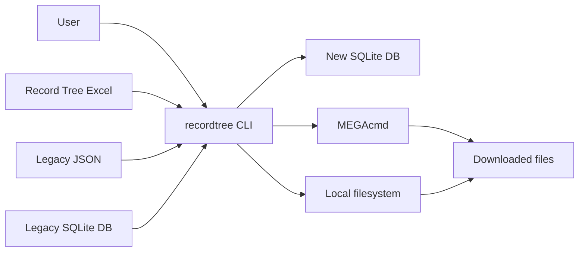

# System Context

## 1. System Positioning

RecordTreeDownloader-SQLite is a command-line program that runs on the user's local machine. It does not scrape remote source sites and does not store MEGA account passwords. It consumes user-provided Record Tree data files and invokes the user's locally installed and already logged-in MEGAcmd to perform downloads.

Core system responsibilities:

- Initialize local configuration, the SQLite database, the download directory, and the log directory.
- Import the latest Excel workbook and support repeated imports.
- Migrate legacy records and download history from the legacy SQLite database.
- Compatibly import legacy JSON export files.
- Search record groups by actor, source, title, date, and download status.
- Display record-group details and active MEGA links.
- Download selected record groups or selected file types, and record download attempts and results.

## 2. External Actors

| Actor | Relationship |
|---|---|
| User | Runs CLI commands for initialization, import, search, info, download, stats, and diagnostics. |
| Excel workbook | Primary v1 data source. The currently observed file is `files/current_record_tree.xlsx`. |
| Legacy SQLite database | Old program database. The currently observed file is `files/legacy_record.db`; it contains historical download status. |
| Legacy JSON export | Old export format. The new tool keeps a compatible import path. |
| SQLite database | Local persistence database created and maintained by the new program. |
| Filesystem | Stores configuration, database files, logs, import error reports, and downloaded files. |
| MEGAcmd | External download tool invoked through `mega-whoami` and `mega-get`. |

## 3. System Boundary

## 4. Main Inputs

- Data source paths: `.xlsx`, `.xlsm`, `.json`, `.db`, `.sqlite`, `.sqlite3`.
- Search filters: actor, title, source, date range, download status.
- Download target: record group id or `source_key`.
- Download filters: whether to include `.par2`, file type list, output directory, and whether to skip confirmation.
- Local configuration: `env/config.toml`.

## 5. Main Outputs

- New SQLite database: `env/recordtree.sqlite3`.
- CLI search results and info tables.
- Import statistics, import error records, and optional error CSV files.
- Downloaded files, defaulting to `downloads/<record_group_id>/`.
- Download attempt records and per-link download status.
- `doctor` diagnostic results.

## 6. Constraints

- v1 prioritizes local Windows usage.
- v1 does not provide a GUI, background scheduled tasks, or multi-user concurrent write support.
- v1 does not automatically store MEGA account credentials.
- v1 does not scrape source sites; it only imports user-provided data files.
- v1 does not require a full-text search engine. Title and metadata search should first use SQLite `LIKE` and indexes.
- Before downloading, the program must verify record existence, link selection, MEGAcmd availability, login status, and disk space.

## 7. Key Assumptions

- The current Excel headers are relatively stable within v1 scope, but the importer must clearly report missing and unsupported columns.
- The Excel `MEGA` column is a JSON string. Invalid rows should be recorded as row-level errors instead of aborting the whole import.
- `上传标题` is not unique, so record identity cannot depend only on that field.
- MEGA URL is an important matching signal when reconciling legacy data with new data.
- A single-file SQLite database can handle the current scale of tens of thousands of record groups, hundreds of thousands of links, and legacy records.
