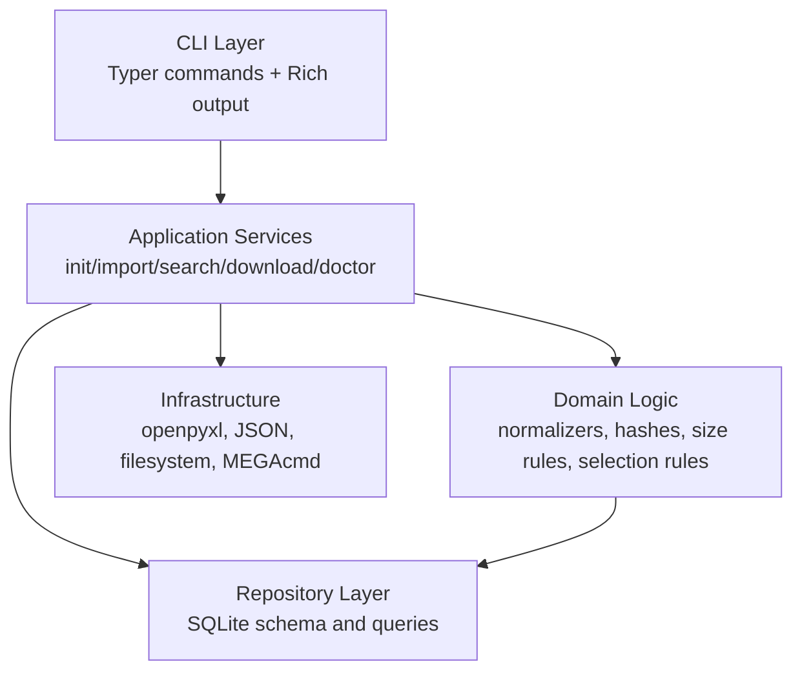

# Architecture

## 1. Architecture Style

The system uses a local single-process CLI architecture, layered by responsibility:

- The CLI layer defines commands, parses arguments, controls exit codes, and renders user-facing output.
- The application service layer orchestrates initialization, import, search, download, and diagnostic use cases.
- The domain logic layer handles normalization, hashes, size calculations, link selection, and status rules.
- The repository layer handles SQLite queries, writes, transactions, and schema initialization.
- The infrastructure layer handles openpyxl, JSON, the filesystem, and MEGAcmd subprocess calls.

This architecture avoids scattering global configuration and database access from the legacy scripts across the codebase. Import, search, and download flows can be tested independently.

## 2. Layered Structure



## 3. Recommended Package Structure

```text
recordtree/
  __init__.py
  __main__.py
  app.py
  cli.py
  config.py
  db.py
  exceptions.py
  importer/
    __init__.py
    excel.py
    json_importer.py
    legacy_db.py
    service.py
  mega.py
  models.py
  normalizers.py
  repositories.py
  schema.sql
  search.py
  sizes.py
tests/
documents/
dev_documents/
legacy/
```

## 4. Module Responsibilities

| Module | Main Responsibilities |
|---|---|
| `recordtree.cli` | Define `recordtree` commands, arguments, exit codes, and Rich output. |
| `recordtree.app` | Orchestrate user use cases and connect CLI, configuration, repositories, and infrastructure. |
| `recordtree.config` | Create, read, and parse `env/config.toml`. |
| `recordtree.db` | Create SQLite connections, initialize schema, and provide transaction boundaries. |
| `recordtree.models` | Define internal data structures such as imported rows, link items, stats results, and download plans. |
| `recordtree.normalizers` | Handle text, dates, actor/source names, file types, and source-key inputs. |
| `recordtree.sizes` | Parse displayed sizes and calculate required download space and safety margins. |
| `recordtree.importer.excel` | Validate Excel headers, stream workbook rows, and parse MEGA JSON. |
| `recordtree.importer.json_importer` | Compatibly import the legacy JSON root-list format. |
| `recordtree.importer.legacy_db` | Validate legacy SQLite schema and migrate legacy records and download status. |
| `recordtree.importer.service` | Provide unified upsert, link replacement, error recording, and import statistics. |
| `recordtree.repositories` | Encapsulate SQL for record groups, links, actors, sources, imports, and downloads. |
| `recordtree.search` | Encapsulate actor/title/source/date/download-status queries. |
| `recordtree.mega` | Resolve MEGAcmd executables, check login status, and invoke `mega-get`. |

## 5. Dependency Direction

Dependencies should be mostly one-way:

```text
cli -> app -> repositories/domain helpers/infrastructure
```

Constraints:

- `cli` does not concatenate SQL directly.
- `importer` does not render terminal tables; it returns statistics and error information.
- `mega` does not access Excel files or import logic.
- `repositories` does not call MEGAcmd.
- Pure rule modules such as `normalizers` and `sizes` do not depend on SQLite, making them easy to unit test.

## 6. Configuration Structure

Default configuration file:

```text
env/config.toml
```

Recommended content:

```toml
[paths]
database = "env/recordtree.sqlite3"
downloads = "downloads"
logs = "logs"

[download]
safety_margin_percent = 5
safety_margin_min_mb = 512
include_par2_by_default = false

[mega]
mega_get = "mega-get"
mega_whoami = "mega-whoami"

[import]
prefer_xlsx_metadata = true
```

## 7. Error Handling Principles

- User argument or configuration errors: show a clear message and return a non-zero exit code.
- Unsupported import file type: stop before import and do not create partial data.
- Row-level import errors: record them in `import_errors` and continue processing other rows.
- Hard import errors: roll back the transaction and mark `imports.status = failed`.
- Download pre-check failures: record a blocked/cancelled status and do not call `mega-get`.
- MEGAcmd execution failures: save exit code and stdout/stderr summaries, then record item-level results.

## 8. Suggested Exit Codes

| Scenario | Exit Code |
|---|---:|
| Success | 0 |
| Argument or configuration error | 2 |
| Target record does not exist | 3 |
| External dependency unavailable | 4 |
| Insufficient disk space | 5 |
| Import or download execution failed | 10 |
