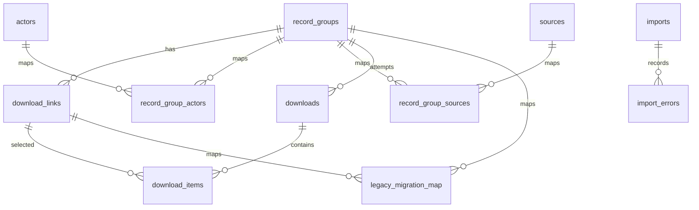
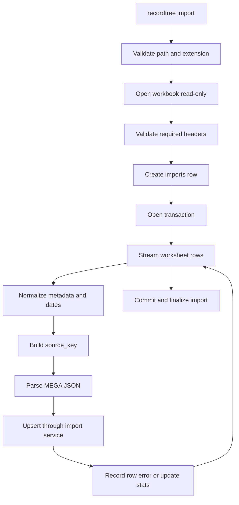
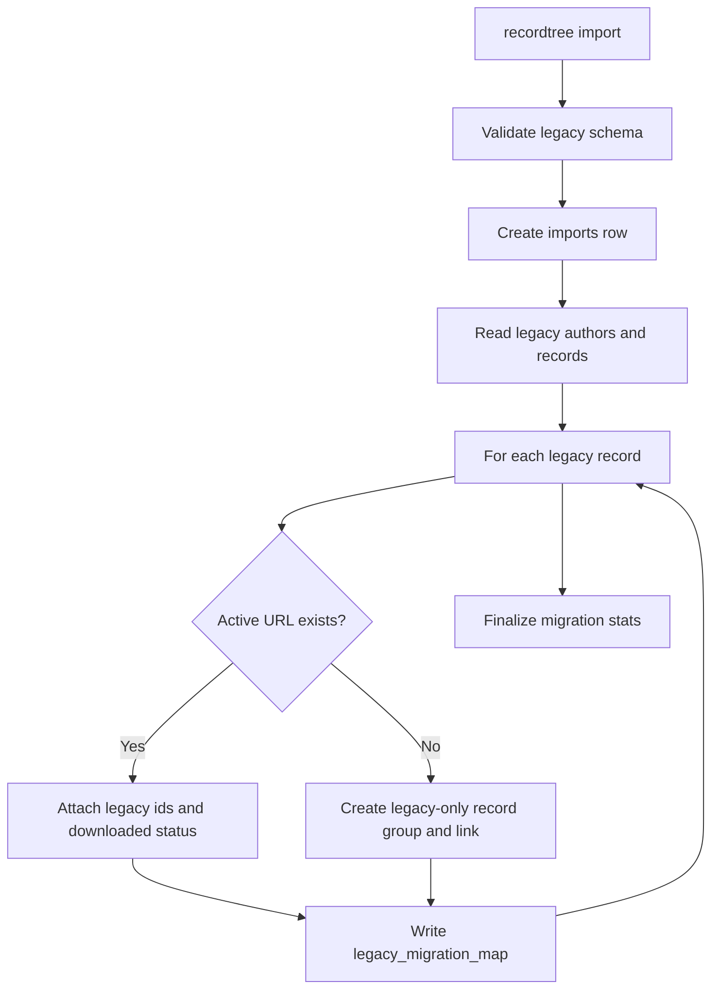
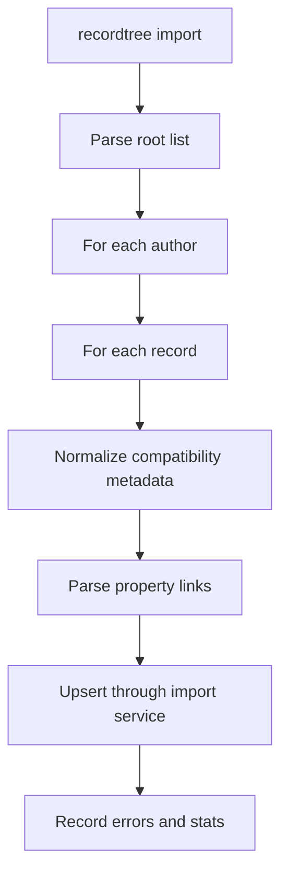

# Data Import And Migration Design

## 1. Data Model Overview

The new database organizes data around record groups. One Excel row, one JSON record, or one legacy-only record belongs to one `record_groups` entity. Each record group has one or more `download_links`.



Core tables:

- `record_groups`: record-group metadata, including actor, dates, title, source, upload title, MEGA root information, and import timestamps.
- `download_links`: current and historical MEGA links. `is_deleted` distinguishes active links from historical links.
- `actors` / `record_group_actors`: normalized actor search mapping.
- `sources` / `record_group_sources`: normalized source search mapping.
- `imports` / `import_errors`: import-job audit records and row-level errors.
- `downloads` / `download_items`: download attempts and link-level download results.
- `legacy_migration_map`: mapping from old SQLite records to new record groups/links.

## 2. Record Identity Strategy

`record_groups.id` is the internal primary key. The stable import identity is `source_key`, generated from the following normalized fields:

```text
actor_raw
delivery_date
title
entry_date
upload_title
source_name
```

Recommended algorithm:

```text
source_key = sha256(json.dumps(normalized_fields, ensure_ascii=False, sort_keys=True))
```

Rationale:

- Upload title is duplicated in the current data and cannot be the only unique key.
- MEGA links may change in later imports and should not define the record itself.
- Record identity should remain stable with metadata, while link changes should be captured as history under the record group.

## 3. Excel Import Design

Excel is the primary v1 data source. Import flow:



Design points:

- Use `openpyxl.load_workbook(read_only=True, data_only=True)` for streaming reads.
- Validate the 10 observed columns by header name; do not rely only on column position.
- Empty dates and empty notes are allowed. Under the current contract, actor, title, source, upload title, MEGA, and size are required.
- Store `FileNames`, `total`, and `FormattedSize` from the `MEGA` JSON root in audit fields on the record group.
- Each valid item under `property` becomes one `download_links` candidate.
- Row-level errors are written to `import_errors`; the final import status may be `completed_with_errors`.

## 4. Link Change Strategy

For the same record group, changes to the active link set are detected with a stable hash. Candidate link tuple:

```text
link_order
mega_url
file_type
size_bytes
formatted_size
```

Processing rules:

- New record group: insert the record group, actor/source mappings, and all active links.
- Existing group with unchanged link set: update `last_seen_at` and do not insert duplicate links.
- Existing group with changed link set: mark old active links as `is_deleted = 1`, write `deleted_at`, then insert the new active links.
- Search and download commands use only active links where `is_deleted = 0` by default.
- Historical links are not physically deleted so source-data changes remain traceable.

## 5. Legacy SQLite Migration Design

Legacy database schema:

```text
author(author_id, name, added_date)
record(record_id, author_id, name, date, size, link, added_date, downloaded_date)
```

Migration flow:



Migration rules:

- Use `legacy_record_id` and URL matching for idempotency.
- `downloaded_date = '0'` means not downloaded.
- `downloaded_date != '0'` is imported as link-level `legacy_completed` history.
- If the URL already exists in Excel-imported results, prefer Excel metadata and add legacy id/download status.
- If the URL does not exist, create a legacy-only record group and preserve available author, date, name, size, and link values.
- If the same URL maps to different record groups, record a conflict instead of silently overwriting data.

## 6. JSON Import Design

JSON import is a compatibility path with lower priority than Excel.

Flow:



Design rules:

- Support the `author -> records[] -> property[]` structure.
- Reuse the Excel link-item parser, source key generation, link hash, and upsert service.
- When a JSON link overlaps with a current Excel link, do not overwrite Excel metadata with lower-quality JSON metadata.
- Malformed author, record, or link items are recorded as row-level errors.

## 7. Transactions And Audit

- Each import first creates an `imports` record with source type, path, start time, and initial status.
- Normal imports use a single transaction to keep one import internally consistent.
- Row-level errors do not roll back the whole transaction.
- Hard errors roll back business writes and mark the import status as `failed`.
- After import completes, write total rows, inserted/updated groups, link-set changes, inserted/skipped links, and error count.

## 8. Query Performance Strategy

Required indexes:

- `record_groups(source_key)`
- `record_groups(delivery_date)`
- `record_groups(entry_date)`
- `record_groups(is_deleted)`
- `actors(name_normalized)`
- `sources(name_normalized)`
- `download_links(record_group_id, is_deleted)`
- `download_links(mega_url)`
- `download_links(file_type)`
- `legacy_migration_map(legacy_record_id)`

FTS5 can be added later as an enhancement, but it is not a required v1 capability.
