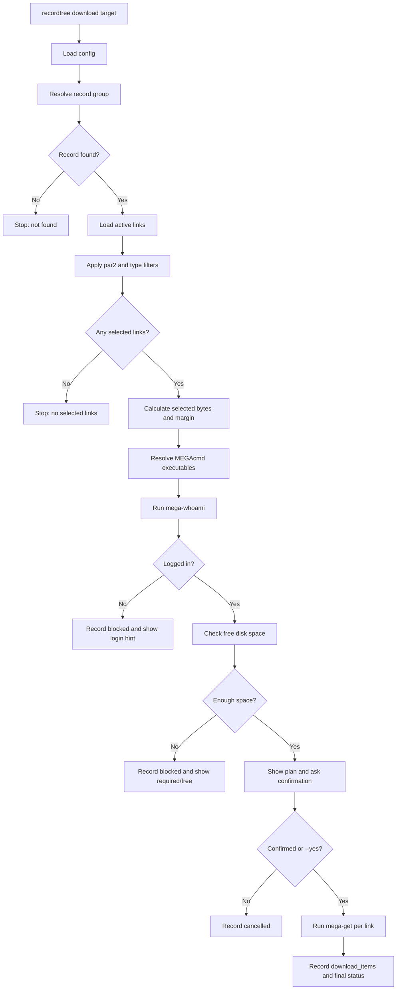

# CLI And Download Design

## 1. Command Overview

Recommended v1 command set:

```text
recordtree init
recordtree doctor
recordtree import <path>
recordtree search-actor <name> [--limit <n>]
recordtree search-title <keyword> [--limit <n>]
recordtree search-source <source> [--limit <n>]
recordtree search-date [--from <date>] [--to <date>] [--limit <n>]
recordtree list-undownloaded [--actor <name>] [--source <source>] [--limit <n>]
recordtree info <record_id_or_key>
recordtree download <record_id_or_key> [--include-par2] [--types <exts>] [--output <dir>] [--yes]
recordtree stats
```

Future expandable commands:

```text
recordtree list-downloaded
recordtree list-imports
recordtree import-errors <import_id>
recordtree config get <key>
recordtree config set <key> <value>
recordtree export-links <record_id_or_key>
```

## 2. Command Responsibilities

| Command | Responsibility |
|---|---|
| `init` | Create configuration, database, download directory, and log directory. It can be run repeatedly. |
| `doctor` | Check configuration, database, directories, MEGAcmd executables, and login status. |
| `import` | Dispatch to the Excel, JSON, or legacy SQLite importer by file extension. |
| `search-actor` | Fuzzy-search record groups by normalized actor name. |
| `search-title` | Search by title, upload title, and duplicate-search helper text. |
| `search-source` | Search by normalized source name. |
| `search-date` | Search by delivery date range. |
| `list-undownloaded` | List record groups that still have active links without completed downloads. |
| `info` | Display one record group's metadata, active links, and download status. |
| `download` | Build a download plan, run pre-checks, invoke MEGAcmd, and record results. |
| `stats` | Display summaries for record groups, links, imports, and download status. |

## 3. Query Display Principles

- Query results are limited to 50 rows by default and support `--limit` override.
- Results are ordered by `delivery_date DESC`, `entry_date DESC`, and `id DESC`.
- Missing dates and notes are displayed as `-` instead of raising errors.
- List results should prioritize ids that users can use in follow-up commands.
- Title, actor, and source output preserves original casing and original text.
- Link URLs are shown as previews in lists; full URLs are displayed by `info` or export commands.

Recommended list columns:

```text
id | delivery_date | actor | title | source | size | active_links | downloaded
```

## 4. Info Command Design

`recordtree info <record_id_or_key>` accepts:

- Numeric internal `record_groups.id`.
- Exact `source_key`.

Output content:

- Record group id and source key.
- Actor, delivery date, entry date, title, source, upload title, and note.
- Workbook size, MEGA total size, and active link count.
- Link table: order, type, formatted size, download status, URL preview.
- If historical inactive links exist, show a count hint but do not expand them by default.

## 5. Download Flow



## 6. File Selection Rules

Default rules:

- Select only active links.
- Exclude `.par2` by default.
- `--include-par2` explicitly includes `.par2`.
- `--types .mp4,.m4a` selects only the specified extensions.
- File type matching should be case-insensitive and should allow user input with or without a leading dot.

When no links remain after filtering, the command should explain why, for example:

```text
No links selected after excluding .par2 and applying --types .mp4
```

## 7. Disk Space Rules

Required space:

```text
sum(selected_link.size_bytes) + max(selected_bytes * safety_margin_percent, safety_margin_min_mb)
```

Default values:

```text
safety_margin_percent = 5
safety_margin_min_mb = 512
```

Directory checks:

- If the output directory exists, check the partition that contains it.
- If the output directory does not exist, check the nearest existing parent directory.
- Create the final output directory only after all pre-checks pass.

## 8. MEGAcmd Integration

The program invokes external processes:

```text
mega-whoami
mega-get <mega_url> <output_dir>
```

Design requirements:

- Use `subprocess.run([...], shell=False)`.
- Executable paths come from configuration or PATH.
- Run `mega-whoami` before downloading.
- If not logged in, stop and prompt the user to manually run `mega-login`.
- Capture exit code and stdout/stderr summaries.
- A single link download failure must not be presented as success; write `download_items.status = failed` for the corresponding item.

## 9. Download Records

Each download command creates one `downloads` row:

- `record_group_id`
- `requested_at`
- `output_dir`
- `selected_bytes`
- `free_bytes_before`
- `status`
- `mega_exit_code`
- `message`

Each selected link creates one `download_items` row:

- `download_id`
- `link_id`
- `status`
- `started_at`
- `finished_at`
- `mega_exit_code`
- `message`

Recommended download final statuses:

```text
planned
completed
failed
blocked
cancelled
legacy_completed
```

## 10. Confirmation Strategy

Unless the user passes `--yes`, the program must show the download plan and ask for confirmation before calling `mega-get`.

Confirmation content:

- Record group id, actor, and title.
- Output directory.
- Selected file count and types.
- Estimated download size.
- Safety margin.
- Current free disk space.
- Whether `.par2` was excluded.
