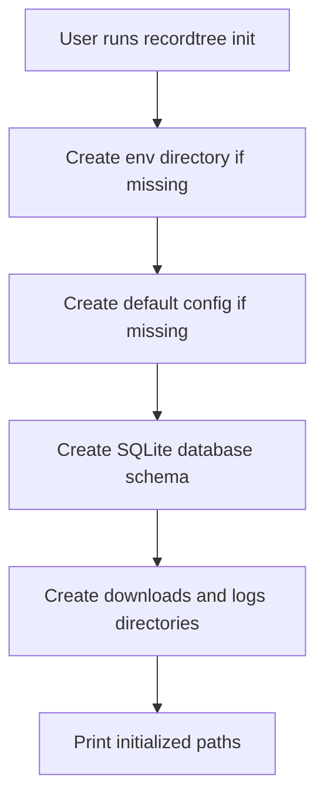
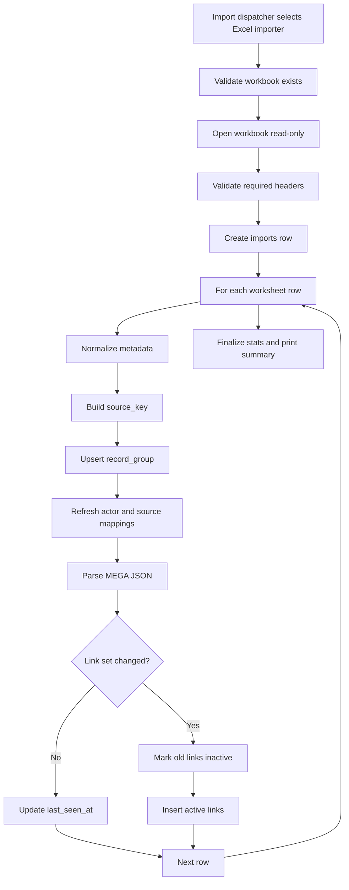
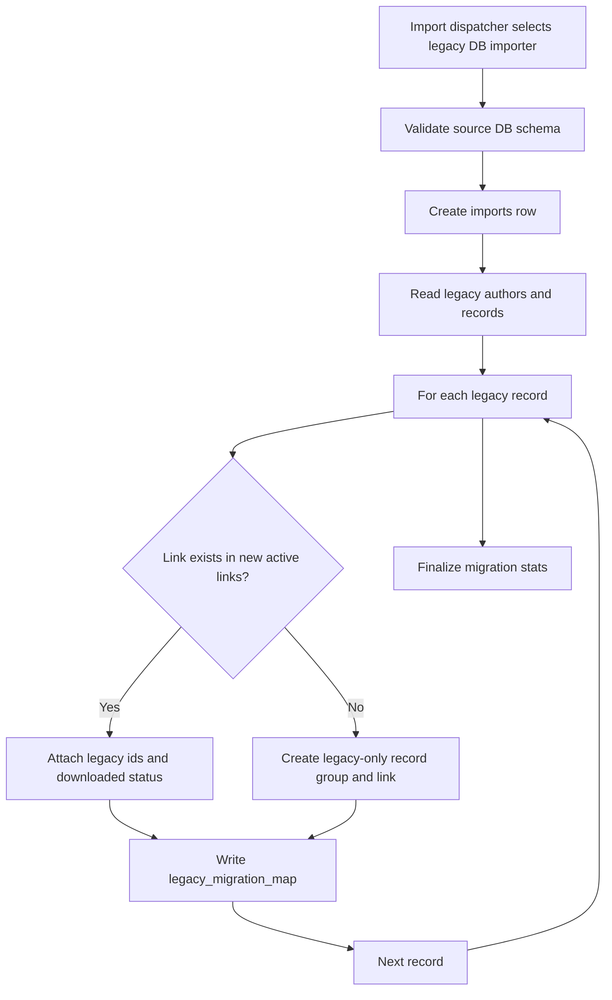
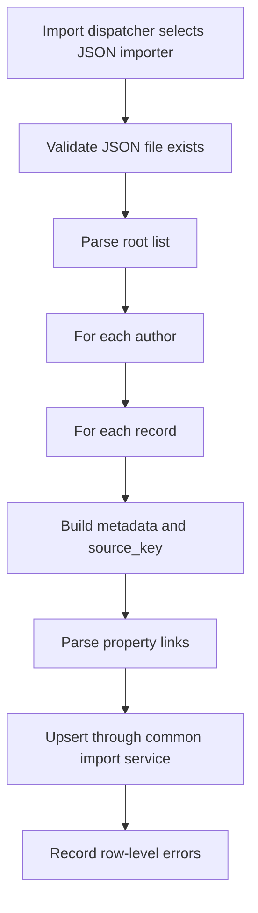
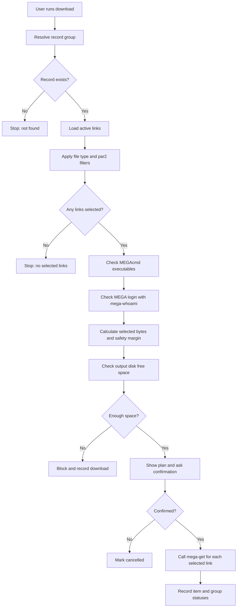

# CLI And Process Flows

## 1. CLI Principles

The program should behave like a predictable local tool:

- Commands should be explicit and safe to rerun.
- Imports should be idempotent.
- Downloads should never start before validating record existence, selected links, MEGAcmd, login state, and disk space.
- Import errors should be summarized in the terminal and stored in the database.
- Search commands should avoid printing huge result sets unless the user raises `--limit`.

## 2. Proposed Command Set

```text
recordtree init
recordtree doctor
recordtree import <path>
recordtree search-actor <name> [--limit <n>]
recordtree search-title <keyword> [--limit <n>]
recordtree search-source <source> [--limit <n>]
recordtree search-date [--from <date>] [--to <date>] [--limit <n>]
recordtree list-undownloaded [--actor <name>] [--source <source>] [--limit <n>]
recordtree info <record_id_or_key>
recordtree download <record_id_or_key> [--include-par2] [--types <exts>] [--output <dir>] [--yes]
recordtree stats
```

Optional later commands:

```text
recordtree list-downloaded
recordtree list-imports
recordtree import-errors <import_id>
recordtree config get <key>
recordtree config set <key> <value>
recordtree export-links <record_id_or_key>
```

## 3. Initialization Flow



Default paths:

```text
env/config.toml
env/recordtree.sqlite3
downloads/
logs/
```

## 4. Import Dispatch Flow

```mermaid
flowchart TD
    A["User runs recordtree import path"] --> B["Validate file exists"]
    B --> C["Read file extension"]
    C --> D{ "Extension" }
    D -->|".xlsx / .xlsm"| E["Use Excel importer"]
    D -->|".json"| F["Use JSON importer"]
    D -->|".db / .sqlite / .sqlite3"| G["Open SQLite and validate legacy schema"]
    D -->|"Other"| H["Stop: unsupported import file type"]
    G --> I{"Legacy author/record tables found?"}
    I -->|Yes| J["Use legacy database importer"]
    I -->|No| K["Stop: not a supported legacy database"]
```

The single import command is the user-facing entry point. Internally, separate importer modules should remain split by format so the implementation stays cohesive.

Optional future flag:

```text
recordtree import <path> --type xlsx|json|legacy-db
```

This override is only for ambiguous files and is not required for normal use.

## 5. Excel Import Flow



Import result should display:

- Source path.
- Total rows scanned.
- Inserted groups.
- Updated groups.
- Skipped groups.
- Link sets changed.
- Inserted links.
- Skipped links.
- Error count.
- Error log path when errors exist.
- Database path.

## 6. Legacy Database Import Flow



Migration display should include:

- Legacy authors scanned.
- Legacy records scanned.
- Records matched by URL.
- Legacy-only groups created.
- Downloaded statuses preserved.
- Conflicts.
- Errors.

## 7. JSON Import Flow



The JSON importer should reuse the same core import service as xlsx where possible.

## 8. Search Commands

### Search Actor

```text
recordtree search-actor "<actor-name>" --limit 50
```

Process:

1. Normalize input.
2. Search `actors.name_normalized LIKE ?`.
3. Join to visible record groups.
4. Sort by `delivery_date DESC`, then `entry_date DESC`, then `id DESC`.

Suggested columns:

```text
id | delivery_date | actor | title | source | size | active_links | downloaded
```

### Search Title

```text
recordtree search-title "ASMR" --limit 50
```

Search `title`, `upload_title`, and optionally `duplicate_search_raw`.

### Search Source

```text
recordtree search-source rPlay --limit 50
```

Search normalized source names.

### List Undownloaded

```text
recordtree list-undownloaded --actor "<actor-name>" --limit 20
```

Should return groups where at least one active non-deleted link has no completed download record.

## 9. Info Command

```text
recordtree info 12345
```

Display:

- Record group id.
- Actor.
- Delivery date.
- Entry date.
- Title.
- Source.
- Upload title.
- Note.
- Total size.
- Active link count and size.
- Link table with order, type, formatted size, download status, and URL preview.

The `record_id_or_key` accepted by v1 can be:

- Numeric internal id.
- Exact `source_key`.

Fuzzy title selection can be added later.

## 10. Download Flow



Default behavior:

- Exclude `.par2` files unless config or `--include-par2` says otherwise.
- Download all selected active links into `downloads/<record_group_id>/`.
- Use `--types .mp4,.m4a` to limit file types.

## 11. Disk Space Rule

Required bytes:

```text
sum(selected active link size_bytes) + max(configured percent margin, configured minimum margin)
```

Suggested defaults:

```text
safety_margin_percent = 5
safety_margin_min_mb = 512
```

If the output directory does not exist:

- Check the nearest existing parent directory.
- Create the final output directory only after validation passes.

## 12. MEGAcmd Handling

Expected commands:

- `mega-whoami`
- `mega-get`

Recommended checks:

1. Resolve executable paths from config or PATH.
2. Run `mega-whoami`.
3. If not logged in, stop with a clear instruction to run `mega-login`.
4. Use `subprocess.run([...], shell=False)` for `mega-get`.
5. Store stdout/stderr summaries and exit codes.

## 13. Configuration

Recommended `env/config.toml`:

```toml
[paths]
database = "env/recordtree.sqlite3"
downloads = "downloads"
logs = "logs"

[download]
safety_margin_percent = 5
safety_margin_min_mb = 512
include_par2_by_default = false

[mega]
mega_get = "mega-get"
mega_whoami = "mega-whoami"

[import]
prefer_xlsx_metadata = true
```
